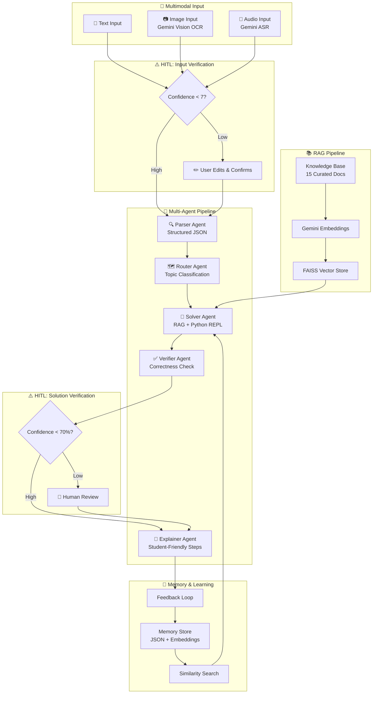

# 🧮 Multimodal Math Mentor

>JEE math tutor that accepts text, image, and audio inputs — built with RAG, multi-agent orchestration, HITL, and self-learning memory.

[](https://math-mentor.streamlit.app)

---

## Architecture



---

## Features

| Feature | Description |
|---------|-------------|
| 📝 Text Input | Type any math problem directly |
| 📷 Image OCR | Upload a photo/screenshot — Gemini Vision extracts text |
| 🎤 Audio ASR | Upload or record audio — Gemini transcribes with math notation |
| 🔍 Parser Agent | Cleans input & produces structured JSON (topic, variables, constraints) |
| 🗺️ Router Agent | Classifies problem type and determines solving strategy |
| 🧮 Solver Agent | Solves using RAG context + memory + Python verification |
| ✅ Verifier Agent | Checks correctness with confidence scoring (0-100%) |
| 📖 Explainer Agent | Generates student-friendly step-by-step explanations |
| 📚 RAG Pipeline | 15 curated docs → FAISS vector search → top-5 retrieval |
| 🧠 Memory | Stores all interactions, finds similar problems, reuses solutions |
| ⚠️ HITL | Triggers on low OCR/ASR confidence, parser ambiguity, verifier uncertainty |
| 💬 Feedback | ✅/❌ buttons with comment field — feeds back into memory |

---

## Tech Stack

- **LLM**: Google Gemini (`gemini-2.5-flash`)
- **Embeddings**: `text-embedding-004`
- **Vector Store**: FAISS
- **UI**: Streamlit
- **Language**: Python 3.10+

---

## Setup & Run

### Prerequisites
- Python 3.10+
- Google Gemini API key ([Get one here](https://makersuite.google.com/app/apikey))

### Installation

```bash
# Clone the repository
git clone https://github.com/yourusername/math-mentor.git
cd math-mentor

# Create virtual environment
python -m venv venv
source venv/bin/activate  # Linux/Mac
# venv\Scripts\activate   # Windows

# Install dependencies
pip install -r requirements.txt

# Set up environment
cp .env.example .env
# Edit .env and add your GOOGLE_API_KEY
```

### Run

```bash
streamlit run app.py
```

The app will open at `http://localhost:8501`.

---

## Project Structure

```
├── app.py                      # Streamlit main application
├── config.py                   # Configuration & environment
├── requirements.txt            # Python dependencies
├── .env.example                # Environment template
├── EVALUATION.md               # Self-evaluation summary
├── knowledge_base/             # 15 curated math documents
│   ├── algebra_formulas.md
│   ├── calculus_formulas.md
│   ├── probability_formulas.md
│   ├── linear_algebra_formulas.md
│   ├── *_solution_templates.md
│   ├── common_mistakes_*.md
│   ├── domain_constraints.md
│   └── jee_tips_*.md
├── rag/                        # RAG pipeline
│   ├── knowledge_loader.py     # Document loading & chunking
│   └── retriever.py            # FAISS embedding & retrieval
├── agents/                     # Multi-agent system
│   ├── parser_agent.py         # Input → structured JSON
│   ├── router_agent.py         # Topic classification & routing
│   ├── solver_agent.py         # Solution with RAG + Python
│   ├── verifier_agent.py       # Correctness verification
│   └── explainer_agent.py      # Student-friendly explanation
├── input_handlers/             # Multimodal input processing
│   ├── image_handler.py        # Gemini Vision OCR
│   ├── audio_handler.py        # Gemini ASR
│   └── text_handler.py         # Text cleanup
├── memory/                     # Memory & self-learning
│   └── memory_store.py         # JSON storage + similarity search
└── utils/
    └── python_executor.py      # Safe Python REPL
```

---

## Math Topics Covered

- **Algebra**: Quadratic equations, sequences, logarithms, inequalities
- **Probability**: Bayes' theorem, distributions, combinatorics
- **Calculus**: Limits, derivatives, integration, optimization
- **Linear Algebra**: Matrices, determinants, eigenvalues, systems of equations

---

## License

MIT
